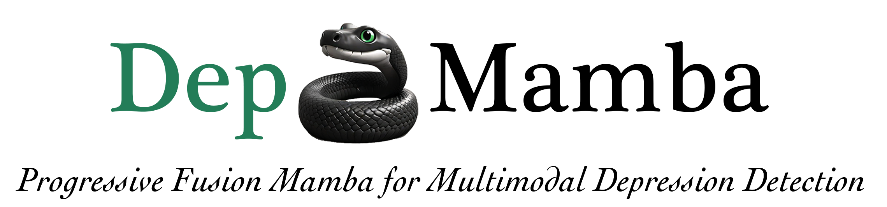

    

    
    

     

    Official PyTorch code for extracting features and training downstream models with  
    <b><em>DepMamba: Progressive Fusion Mamba for Multimodal Depression Detection</em></b>
    

    

    

    
    
    
    

