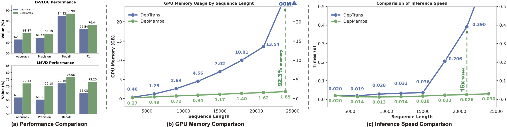
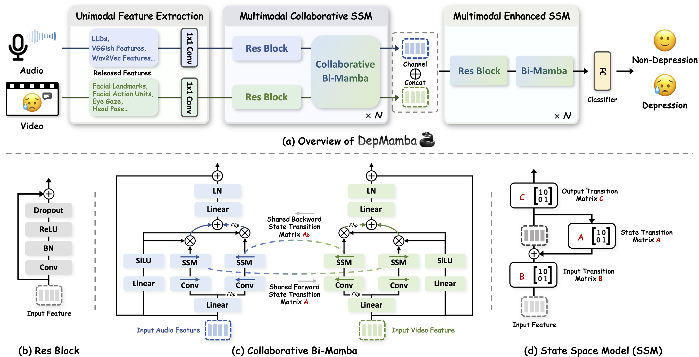

<div align="center">
    <p>
    
    </p>
     <p>
    Official PyTorch code for training and inference pipeline for <br>
    <b><em>DepMamba: Progressive Fusion Mamba for Multimodal Depression Detection</em></b>
    </p>
    <p>
    
    </p>
     <a href="https://arxiv.org/abs/2409.15936"></a>    
    <a href="https://github.com/Jiaxin-Ye/DepMamba"></a>
    <a href="https://github.com/Jiaxin-Ye/DepMamba"></a>
    <a href="https://github.com/Jiaxin-Ye/DepMamba"></a>
    <a href="https://github.com/Jiaxin-Ye/DepMamba"></a>
</div>


### 📕Introduction

In this work, we propose an audio-visual progressive fusion Mamba model for efficient multimodal depression detection,  termed **DepMamba**. Specifically, the DepMamba features two core designs: hierarchical contextual modeling and progressive multimodal fusion. First, we introduce CNN and Mamba blocks to extract features from local to global scales, enriching contextual representation within long-range sequences. 
Second, we propose a multimodal collaborative State Space Model (SSM) that extracts intermodal and intramodal information for each modality by sharing state transition matrices. A multimodal enhanced SSM is then employed to process concatenated audio-visual features for improved modality cohesion. 

<div align="center">
    <p>
    
    </p>
    

</div>

## 📖 Usage:


### 1. Clone Repository

```bash
git clone https://github.com/Jiaxin-Ye/DepMamba.git
```

### 2. Requirements

Our code is based on Python 3.8 and CUDA 11.7. There are a few dependencies for running the code. The major libraries including Mamba and PyTorch are listed as follows:

```bash
conda create -n DepMamba -c conda-forge python=3.8
conda install pytorch==2.0.1 torchvision==0.15.2 torchaudio==2.0.2 pytorch-cuda=11.7 -c pytorch -c nvidia
conda install packaging
git clone https://github.com/Dao-AILab/causal-conv1d.git 
cd causal-conv1d 
git checkout v1.1.3 
CAUSAL_CONV1D_FORCE_BUILD=TRUE pip install .
cd ..
git clone https://github.com/state-spaces/mamba.git
cd ./mamba
git checkout v1.1.3
MAMBA_FORCE_BUILD=TRUE pip install .
pip install -r requirement.txt
```

If you want to record training log, you need to login your own `wandb` account. 

```bash
wandb login
```

Change these lines in `main.py` to your own account.

```python
wandb.init(
    project="DepMamba", entity="<your-wandb-id>", config=args, name=wandb_run_name,
)
```

### 3. Prepare Datasets

We use the [D-Vlog](https://doi.org/10.1609/aaai.v36i11.21483) and [LMVD](https://arxiv.org/abs/2407.00024) dataset, proposed in this paper. For the D-Vlog dataset, please fill in the form at the bottom of the [dataset website](https://sites.google.com/view/jeewoo-yoon/dataset), and send a request email to the [author](mailto:yoonjeewoo@gmail.com). For the LMVD dataset, please download features on the released [Baidu Netdisk website](https://pan.baidu.com/s/1gviwLfbFcRSaARP5oT9yZQ?pwd=tvwa) or [figshare](https://figshare.com/articles/dataset/LMVD/25698351). 

Following D-Vlog's setup, the dataset is split into train, validation and test sets with a 7:1:2 ratio. For the LMVD without official splitting, we randomly split the LMVD with an 8:1:1 ratio and the specific division is stored in `./datasets/lmvd_labels.csv'.

### 5. Training and Testing

#### Training

```bash
$ python main.py --train True --train_gender both --test_gender both --epochs 120 --batch_size 16 --learning_rate 1e-4 --model DepMamba --dataset dvlog --gpu 0

$ python main.py --train True --train_gender both --test_gender both --epochs 120 --batch_size 16 --learning_rate 1e-4 --model DepMamba --dataset lmvd --gpu 0
```

#### Testing

```bash
$ python main.py --train False --test_gender both --epochs 120 --batch_size 16 --learning_rate 1e-4 --model DepMamba --dataset dvlog --gpu 0

$ python main.py --train False --test_gender both --epochs 120 --batch_size 16 --learning_rate 1e-4 --model DepMamba --dataset lmvd --gpu 0
```


## 📖 Citation

- If you find this project useful for your research, please cite [our paper](https://arxiv.org/abs/2211.08233):

```bibtex
@article{yedepmamba,
  title={DepMamba: Progressive Fusion Mamba for Multimodal Depression Detection},
  author = {Jiaxin Ye and Junping Zhang and Hongming Shan},
  journal      = {CoRR},
  volume       = {abs/xxxxxx},
  year         = {2024},
  eprinttype    = {arXiv},
  eprint       = {xxxxxx},
}
```

## 🙌🏻 Acknowledgement

- We acknowledge the wonderful work of [Mamba](https://arxiv.org/abs/2312.00752) and [Vision Mamba](https://arxiv.org/abs/2401.09417). 
- We borrow their implementation of [Mamba](https://github.com/state-spaces/mamba) and [bidirectional Mamba](https://github.com/hustvl/Vim). 
- We acknowledge [AllenYolk](https://github.com/AllenYolk/depression-detection) and [ConMamba](https://github.com/xi-j/Mamba-ASR).
- The training pipelines are adapted from [SpeechBrain](https://speechbrain.github.io).
